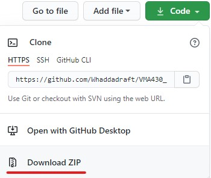
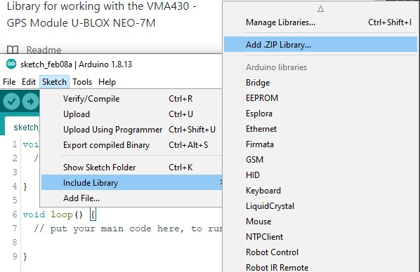

# Whadda WPI430/VMA430 - GPS MODULE U-BLOX NEO-7M

This repository contains the library and example code to work with our Whadda WPI430/VMA430 GPS MODULE with the U-BLOX NEO-7M chipset. It can configure the module to send out UBX data packets, and is able to decode the time and location data.

## Background info

Most GPS modules output so called NMEA sentences that can be interpretted by a variety of programs. The Whadda WPI430 GPS module is also able to send data in the form of UBX packets, a custom protocol designed by U-Blox (the manufacturer of the GPS chipset on the module). 
UBX packets use a more compact data encoding algorithm which makes it faster to decode the corresponding data on low-resource computers/microcontrollers such as the AVR based Arduino's. 

This library only uses the UBX packets to decode the data.


## Installation

1. Download the most recent version of the Arduino library by clicking the ```Download ZIP``` option in the Code menu:



2. Open the Arduino IDE, click on Sketch > Include Library > Add .ZIP Library...



3. Open the .ZIP file you just downloaded, a message should appear in the Arduino IDE: "Library added to your libraries. Check "include library" menu."

## Example

### Wiring
Wire up the GPS module to an Arduino compatible board as shown below:

|GPS Module|Arduino board|
|----------|-------------|
|VCC|5V|
|GND|GND|
|TXD|D3|
|RXD|D2|


### Programming

1. Open the Arduino IDE, open the GPS example sketch by going to ```File > Examples > WPI430/VMA430 GPS > Show_time_location``` (you might have to scroll down in the examples list to be able to see it)
2. Upload the example to your Arduino board
3. Open the Serial Monitor, make sure it is set to a baudrate of 9600 baud

The example program will first set-up the GPS-module by setting it's communication protocols. It will enable the module to send out UBX messages next to the standard NMEA messages that it normally outputs.
The program will then decode these UBX messages, and show the parsed output. The data that is sent out includes location data (latitude & longitude) and UTC time (hours, minutes & seconds).